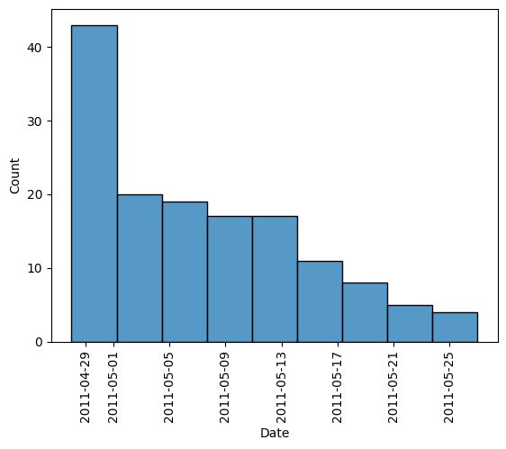
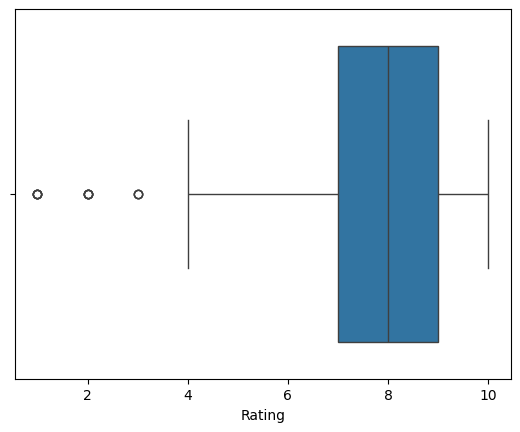
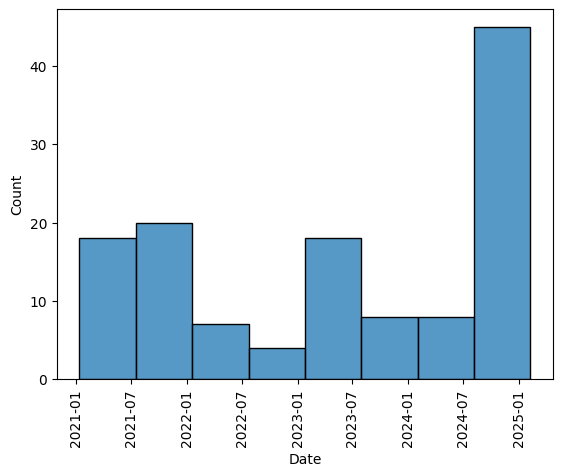
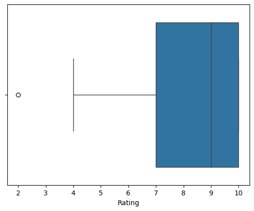
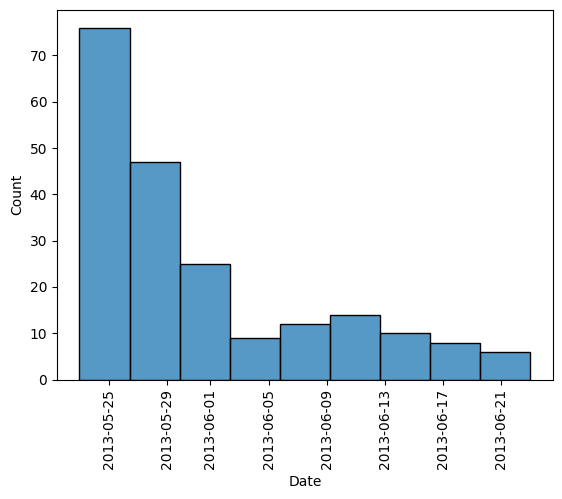
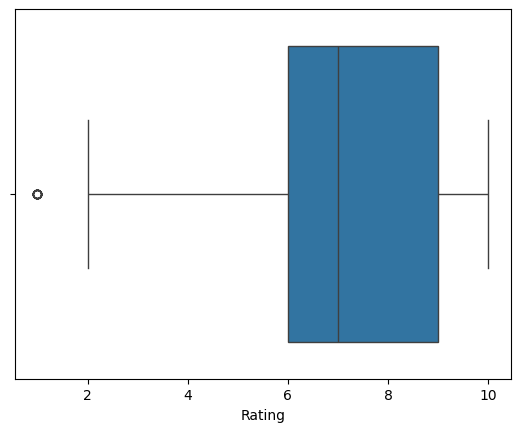
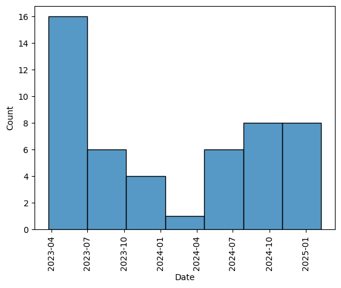
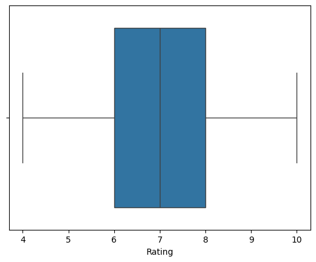

# Data Appendix

## Introduction/Overview:

---

## Section 1: Dataset 1 - The Fast and Furious Reviews (June-July 2001)

### Unit of Observation:
Each row in the dataset represents a movie review from a user for the first movie in the Fast and Furious franchise, _The Fast and Furious_, written between **June 22nd and July 13th, 2001**. The unit of observation is a movie review, where each row contains the following attributes:

### Variables:
- **Rating**: Floats 
- **Title**: Objects
- **Content**: Object
- **Author Name**: Object
- **Date**: DateTime 
- **Year**: Float
 

### Descriptive Statistics:

#### Summary Statistics for Rating:
- **Defintion**: Numeric values representing the review rating. Missing data was replaced with the mean of all numeric ratings in the dataset.
- **missing values**: There are no missing values in the datset after cleaning, they were replaced by the mean rating score of the datset
- **method to final form**: The dates were extracted from the movie's IMDb page using Selenium. In Python, the mean for the specified time period was calculated and used to replace any "No rating" values in the dataset.

### Figures and Tables:

| Metric | Value |
|--------|-------|
| Count  | 162   |
| Mean   | 7.93  |
| Min    | 1     |
| 25%    | 7.93  |
| Median | 8     |
| 75%    | 10    |
| Max    | 10    |
| Std Dev| 2.29  |

#### Figure 1:  Boxplot of data (June-July 2001)

*The June-July 2001 dataset consists of 162 reviews with an average rating of 7.93. Ratings range from 1 to 10, with most ratings being above 7.93. The median rating is 8, and the standard deviation is 2.29, indicating some variation in user opinions. Most reviews are highly positive, with a significant number of 10 ratings.*

#### Figure 2: Mean of Movie Reviews by Date (June-July 2001)

This graph shows how the average star rating changes over time

#### Summary Statistics for Date:
- **Defintion**: The date the review was published.
- **Date Range**: The reviews span from **June 22, 2001** to **July 13, 2001**.
- **missing values**: None
- **method to final form**: The dates were scraped from the movies imdb page using selenium. It was then changed to fit a YYYY-MM-DD format in python. 

### Figures:
#### Figure 3: Distribution of Movie Reviews by Date (June-July 2001)

This graph shows the distribution of reivew dates

#### Summary of Title:
- **Defintion**: The name of the review.
- **missing values**: None
- **method to final form**: The review titles were scraped from the movies imdb page using selenium.
  
#### Summary of Content:
**Defintion**: The review text written by the user.
- **missing values**: None
- **method to final form**: Reviews were scraped from the movie’s IMDb page using Selenium. Reviews marked with a spoiler warning were initially scraped as having "No content". To clean the dataset, missing reviews were manually identified, and content was copied from the original source into the CSV file.

#### Summary of Author Name:
- **Definition**: The name of the reviewer
- **missing values**: None
- **method to final form**: The reviewers names were scraped from the movies imdb page using selenium.

#### Summary of Year:
- **Defintion**: The Year the review was published.
- **Year Range**: 2001 for all
- **missing values**: None
- **method to final form**: The years were extracted from the full date using python
---

## Section 2: Dataset 2 - The Fast and Furious Reviews (Post-2011)

### Unit of Observation:
Each row in the dataset represents a movie review from a user for _The Fast and the Furious_, written during and after **2011**. The unit of observation remains the same as in Dataset 1: a movie review with attributes such as Rating, Title, Content, Author Name, and Date.

### Variables:
- **Rating**: Floats 
- **Title**: Objects
- **Content**: Object
- **Author Name**: Object
- **Date**: DateTime 
- **Year**: Float

### Descriptive Statistics:

#### Summary Statistics for Rating:
- **Defintion**: Numeric values representing the review rating. Missing data was replaced with the mean of all numeric ratings in the dataset.
- **missing values**: There are no missing values in the datset after cleaning, they were replaced by the mean rating score of the datset
- **method to final form**: The dates were extracted from the movie's IMDb page using Selenium. In Python, the mean for the specified time period was calculated and used to replace any "No rating" values in the dataset.
### Figures and Tables:
| Metric | Value |
|--------|-------|
| Count  | 374.000000|
| Mean   | 7.442308 |
| Min    | 1.000000 |
| 25%    | 6.000000 |
| Median | 8.000000 |
| 75%    | 10.000000|
| Max    | 10.000000 |
| Std Dev| 2.34765|

#### Figure 4:  Boxplot of data (2011 and after)

*This dataset contains 374 reviews, with ratings ranging from 1 to 10. The average rating is 7.44, and the ratings are generally distributed between 6 and 10. The reviews span from April 28, 2011, to February 3, 2025, with a notable concentration of reviews around 2021 and 2023. The standard deviation of ratings is 2.35, indicating moderate variability in user reviews.*

#### Figure 5: Mean of Movie Reviews by Date (2011 and after)

This graph shows the distribution of reviews by year

#### Summary Statistics for Date:
- **Defintion**: The date the review was published.
- **Date Range**: - The reviews include anything posted on IMdb after Dec 31, 2010

#### Summary of Title:
- **Defintion**: The name of the review.
- **missing values**: None
- **method to final form**: The review titles were scraped from the movies imdb page using selenium.
  
#### Summary of Content:
**Defintion**: The review text written by the user.
- **missing values**: None
- **method to final form**: Reviews were scraped from the movie’s IMDb page using Selenium. Reviews marked with a spoiler warning were initially scraped as having "No content". To clean the dataset, missing reviews were manually identified, and content was copied from the original source into the CSV file.

#### Summary of Author Name:
- **Definition**: The name of the reviewer
- **missing values**: None
- **method to final form**: The reviewers names were scraped from the movies imdb page using selenium.

#### Summary of Year:
- **Defintion**: The Year the review was published.
- **Year Range**: 20011 - 2025
- **missing values**: None
- **method to final form**: The years were extracted from the full date using python

### Figures:
#### Figure 6: Distribution of Movie Reviews by Year (Post 2011)

This graph shows how the average star rating changed over time

---

## Section 3: Dataset 3 - 2 Fast 2 Furious Reviews (June 2003)

### Unit of Observation:
Each row in the dataset represents a movie review from a user for the second movie in the Fast and Furious franchise, _2 Fast 2 Furious_, written between **June 6th 2003 and June 28th, 2003**. The unit of observation is a movie review, where each row contains the following attributes:

### Variables:
- **Rating**: Floats 
- **Title**: Objects
- **Content**: Object
- **Author Name**: Object
- **Date**: DateTime 
- **Year**: Float
 
### Descriptive Statistics:

#### Summary Statistics for Rating:
- **Defintion**: Numeric values representing the review rating. Missing data was replaced with the mean of all numeric ratings in the dataset.
- **missing values**: There are no missing values in the datset after cleaning, they were replaced by the mean rating score of the datset
- **method to final form**: The dates were extracted from the movie's IMDb page using Selenium. In Python, the mean for the specified time period was calculated and used to replace any "No rating" values in the dataset.

### Figures and Tables:

| Metric   | Value    |
|----------|----------|
| Count    | 103  |
| Mean     | 6.07    |
| Min      | 1   |
| 25%      | 5  |
| Median   | 6.07   |
| 75%      | 8  |
| Max      | 10    |
| Std Dev  | 2.72  |

#### Figure 1:  Boxplot of data (June 2003)

*This boxplot displays the distribution of ratings for the movie reviews in June 2003. The ratings range from 1 to 10, with a median rating of 6.07 and a mean of 6.07. The dataset consists of 103 reviews, and the ratings show a moderate spread, with a standard deviation of 2.72.

#### Figure 2: Mean of Movie Reviews by Date (June 2001)

This graph shows how the average star rating changes over time

#### Summary Statistics for Date:
- **Defintion**: The date the review was published.
- **Date Range**: The reviews span from **June 6, 2003** to **July 28, 2003**.
- **missing values**: None
- **method to final form**: The dates were scraped from the movies imdb page using selenium. It was then changed to fit a YYYY-MM-DD format in python. 

### Figures:
#### Figure 3: Distribution of Movie Reviews by Date (June 2003)

This graph shows the distribution of reivew dates

#### Summary of Title:
- **Defintion**: The name of the review.
- **missing values**: None
- **method to final form**: The review titles were scraped from the movies imdb page using selenium.
  
#### Summary of Content:
**Defintion**: The review text written by the user.
- **missing values**: None
- **method to final form**: Reviews were scraped from the movie’s IMDb page using Selenium. Reviews marked with a spoiler warning were initially scraped as having "No content". To clean the dataset, missing reviews were manually identified, and content was copied from the original source into the CSV file.

#### Summary of Author Name:
- **Definition**: The name of the reviewer
- **missing values**: None
- **method to final form**: The reviewers names were scraped from the movies imdb page using selenium.

#### Summary of Year:
- **Defintion**: The Year the review was published.
- **Year Range**: 2003 for all
- **missing values**: None
- **method to final form**: The years were extracted from the full date using python
---

## Section 4: Dataset 4 - 2 Fast 2 Furious Reviews (2013 and after)

### Unit of Observation:
Each row in the dataset represents a movie review from a user for _2 Fast to Furious, written after **2013**. The unit of observation remains the same as in Dataset 1: a movie review with attributes such as Rating, Title, Content, Author Name, and Date.

### Variables:
- **Rating**: Floats 
- **Title**: Objects
- **Content**: Object
- **Author Name**: Object
- **Date**: DateTime 
- **Year**: Float
 
### Descriptive Statistics:

#### Summary Statistics for Rating:
- **Defintion**: Numeric values representing the review rating. Missing data was replaced with the mean of all numeric ratings in the dataset.
- **missing values**: There are no missing values in the datset after cleaning, they were replaced by the mean rating score of the datset
- **method to final form**: The dates were extracted from the movie's IMDb page using Selenium. In Python, the mean for the specified time period was calculated and used to replace any "No rating" values in the dataset.
  
#### Summary Statistics for Rating:

| Metric   | Value    |
|----------|----------|
| Count    | 208      |
| Mean     | 6.24     |
| Min      | 1.00     |
| 25%      | 5.00     |
| Median   | 6.00     |
| 75%      | 8.00     |
| Max      | 10.00    |
| Std Dev  | 2.26     |
`

#### Figure 1:  Boxplot of data (2013 and after)

*The boxplot above displays the distribution of ratings for the Post-2013 Fast and Furious dataset. The median rating is around 6, with a wide range of reviews, from 1 to 10. The distribution has a similar shape to the 2003 dataset.

#### Figure 2: Mean of Movie Reviews by Date (2013 and after)

This graph shows how the average star rating changes over time

#### Summary Statistics for Date:
- **Defintion**: The date the review was published.
- **Date Range**: The reviews span from **February 14, 2013** to **ebruary 4, 2025**.
- **missing values**: None
- **method to final form**: The dates were scraped from the movies imdb page using selenium. It was then changed to fit a YYYY-MM-DD format in python.

#### Summary of Title:
- **Defintion**: The name of the review.
- **missing values**: None
- **method to final form**: The review titles were scraped from the movies imdb page using selenium.

#### Summary of Content:
**Defintion**: The review text written by the user.
- **missing values**: None
- **method to final form**: Reviews were scraped from the movie’s IMDb page using Selenium. Reviews marked with a spoiler warning were initially scraped as having "No content". To clean the dataset, missing reviews were manually identified, and content was copied from the original source into the CSV file.

#### Summary of Author Name:
- **Definition**: The name of the reviewer
- **missing values**: None
- **method to final form**: The reviewers names were scraped from the movies imdb page using selenium.

#### Summary of Year:
- **Defintion**: The Year the review was published.
- **Year Range**: 2013-2025
- **missing values**: None
- **method to final form**: The years were extracted from the full date using python
### Figures:
#### Figure 3: Distribution of Movie Reviews by Year (2013 and after)

---

--

## Section 5: Dataset 5 - The Fast and The Furious: Tokyo Drift (2006, First three weeks)

### Unit of Observation:
Each row in the dataset represents a movie review from a user for _The Fast and the Furious: Tokyo Drift_, written between June 16, 2006- July 6, 2006. The unit of observation remains the same as in Dataset 1: a movie review with attributes such as Rating, Title, Content, Author Name, Date, and Year.

### Variables:
- **Rating**: Float64
- **Title**: Objects
- **Content**: Object
- **Author Name**: Object
- **Date**: DateTime 
- **Year**: Int64

### Descriptive Statistics:

#### Summary Statistics for Rating:

- **Defintion**: Numeric values representing the review rating. 
- **Missing Values**: Missing values were handled in cleaning by replacing "No rating" with the mean of the rating. There are no missing values in cleaned data.
- **Method to Final Form**: The ratings were extracted from the movie's user reviews IMDb page using BeautifulSoup and Selenium. In Python, the ratings datatype was converted from object to floats. Then, the mean for the specified time period was calculated and used to replace any "No rating" values in the dataset.
  
| Metric | Value |
|--------|-------|
| Count  | 126.000000 |
| Mean   | 7.055556 |
| Min    | 1.000000 |
| 25%    | 5.000000 |
| Median | 8 |
| 75%    | 10.000000 |
| Max    | 10.000000  |
| Std Dev| 2.860225 |

#### Figure 1:  Boxplot of data (June 16, 2006 - July 6,2006)

The boxplot above shows the distribution of ratings, ranging from 1 to 10, for the movie reviews submitted between June and July of 2006. A total of 126 ratings were recorded, with the average rating being 7.05. The ratings tend to skew toward the higher end, as indicated by a median of 8. The majority of reviews fall at or above a rating of 6. However, the standard deviation of 2.86 suggests that there is some variability in user opinions, with a significant spread between the lowest and highest ratings.

#### Figure 2: Mean of Movie Ratings by Date (June 16, 2006 - July, 6, 2006)

The graph above represents the mean star ratings for each date, showing how the rating changed over the three-week period following the release of the movie.

#### Summary Statistics for Date:
- **Definition:** The date the review was posted.
- **Date Range:** June + July 2006 to 2016-2025
- **Missing value:** There were no missing values.
- **Method to final form:** The date was extracted from the movies's user reviews IMDb page using BeautifulSoup and Selenium. In Python, the datatype was converted from object to datatime.
- **Total number of reviews: 126 total.

#### Figures 3: Distribution of The Fast and Furious: Tokyo Drift Movie Reviews by Date (June 16, 2006 - July 6, 2006)

This graph above shows the distribution of reviews made by date.

#### Summary of Title:
- **Defintion**: The name of the review.
- **missing values**: None
- **method to final form**: The review titles were scraped from the movie's user reviews IMDb page using BeautifulSoup and selenium.

#### Summary Statistic for Content:
- **Defintion:** The text of the review.
- **Missing value:** Missing values were handled in cleaning by replacing "No content" with the text of the review manually taken
  from the website. There are no missing values in cleaned data.
- **Method to final form:** Initially, when scraping reviews, any reviews that had spoilers were scraped as "No content." These were then manually updated by copying the actual review text from the user’s review. A dictionary was created in Python to map the correct index number to the corresponding review text leaving no missing reviews.
- **Average Review Length**: About 1241 Characters

#### Summary Statistic for Author Name:
- **Defintion:** The username fo the reviwer.
- **Missing value:** No missing values.
- **Method to final form:** The Author Name's were scraped from the movie's use reviews IMDb page using BeautifuSoup and selenium.
- **Unique Reviewers**: 126 Total.

#### Summary Statistic for Year:
- **Definition:** The date the review was posted.
- **Date Range:** June 16 - July 6, 2006
- **Missing value:** No missing values
- **Method to final form:** Created by extracting only the year from the date coulmn in python and creating a new column name "Year." Then 
  converted to int64(YYYY) in python. 

--

## Section 6: Dataset 6 - The Fast and The Furious: Tokyo Drift (2016 and after)

### Unit of Observation:
Each row in the dataset represents a movie review from a user for _The Fast and the Furious: Tokyo Drift_, written between 2016 to the present. The unit of observation remains the same as in Dataset 1: a movie review with attributes such as Rating, Title, Content, Author Name, Date, and Year.

### Variables:
- **Rating**: Float64
- **Title**: Objects
- **Content**: Object
- **Author Name**: Object
- **Date**: DateTime 
- **Year**: Int64

### Descriptive Statistics:

#### Summary Statistics for Rating:

- **Defintion**: Numeric values representing the review rating. 
- **Missing Values**: Missing values were handled in cleaning by replacing "No rating" with the mean of the rating. There are no missing values in cleaned data.
- **Method to Final Form**: The ratings were extracted from the movie's user reviews IMDb page using BeautifulSoup and Selenium. In Python, the ratings datatype was converted from object to floats. Then, the mean for the specified time period was calculated and used to replace any "No rating" values in the dataset.
  
| Metric | Value |
|--------|-------|
| Count  | 195.000000 |
| Mean   |  6.533333 |
| Min    | 1.000000 |
| 25%    | 5.000000 |
| Median | 6.000000 |
| 75%    | 8.000000 |
| Max    | 10.000000 |
| Std Dev| 2.333677 |

#### Figure 1:  Boxplot of data (2016 - 2025)

The boxplot above shows the distribution of movie ratings, ranging from 1 to 10, for reviews submitted between 2016 and 2025. A total of 195 ratings were recorded, with an average rating of 6.53. The ratings are slightly skewed towards the higher end, with a median of 6. Most reviews fall between a rating of 5 and 8, but the standard deviation of 2.33 indicates some variability in opinions. The presence of ratings as low as 1 and as high as 10 suggests that while many reviewers gave moderate to positive ratings, there are also outliers indicating extreme opinions.

#### Figure 2: Mean of Movie Ratings by Year (2016 - 2025)

The graph above represents the mean star ratings for each year, showing how the ratings have changed over a decade later after the 
release of the movie.

#### Summary Statistics for Date:
- **Definition:** The date the review was posted.
- **Date Range:** 2016-2025
- **Missing value:** No missing values
- **Method to final form:** The date was extracted from the movies's user reviews IMDb page using BeautifulSoup and Selenium. In Python, the datatype was converted from object to datatime.
- **Total number of reviews: 194 total.

#### Summary of Title:
- **Defintion**: The name of the review.
- **missing values**: No mising values.
- **method to final form**: The review titles were scraped from the movies IMDb page using BeautifulSoup and Selenium.
- **Unique Reviewers**: 194 Total.

#### Summary Statistic for Content:
- **Defintion:** The text of the review.
- **Missing value:** Missing values were handled in cleaning by replacing "No content" with the text of the review manually taken
  from the website. There are no missing values in cleaned data.
- **Method to final form:** Initially, when scraping reviews, any reviews that had spoilers were scraped as "No content." These were then manually updated by copying the actual review text from the user’s review. A dictionary was created in Python to map the correct index number to the corresponding review text leaving no missing reviews.
- **Average Review Length**: About 942 Characters

#### Summary Statistic for Author Name:
- **Defintion:** The username fo the reviwer.
- **Missing value:** No missing values.
- **Method to final form:** The Author Name's were scraped from the movie's use reviews IMDb page using BeautifuSoup and selenium. 

#### Summary Statistic for Year:
- **Definition:** The date the review was posted.
- **Date Range:** 2016 - 2025
- **Missing value:** No missing values.
- **Method to final form:** Created by extracting only the year from the date coulmn in python and creating a new column name "Year." Then 
  converting Year's data type to int64(YYYY) in python. 

#### Figures 3: Distribution of The Fast and Furious: Tokyo Drift Movie Reviews by Year (2016-2025)

This graph shows the distibution of reviews made by year.

--

## Section 7: Dataset 7 - Fast & Furious: (2009, First three weeks)

### Unit of Observation:
Each row in the dataset represents a movie review from a user for _Fast & Furious_, written between March 30, 2009 - April 9, 2009. The unit of observation remains the same as in Dataset 1: a movie review with attributes such as Rating, Title, Content, Author Name, Date, and Year.

### Variables:
- **Rating**: Float64
- **Title**: Objects
- **Content**: Object
- **Author Name**: Object
- **Date**: DateTime 
- **Year**: Int64

### Descriptive Statistics:

#### Summary Statistics for Rating:

- **Defintion**: Numeric values representing the review rating. 
- **Missing Values**: Missing values were handled in cleaning by replacing "No rating" with the mean of the rating. There are no missing values in cleaned data.
- **Method to Final Form**: The ratings were extracted from the movie's user reviews IMDb page using BeautifulSoup and Selenium. In Python, the ratings datatype was converted from object to floats. Then, the mean for the specified time period was calculated and used to replace any "No rating" values in the dataset.
  
| Metric | Value |
|--------|-------|
| Count  | 66.000000 |
| Mean   | 7.181818 |
| Min    | 1.000000 |
| 25%    | 6.000000 |
| Median | 7.000000 |
| 75%    | 9.000000 |
| Max    | 10.000000 |
| Std Dev| 2.169077 |

#### Figure 1:  Boxplot of data (March 30 - April 9, 2009)

The boxplot above shows the distribution of movie ratings, ranging from 1 to 10, for reviews submitted between March 30 and April 9, 2009, for a movie released on March 12. A total of 66 ratings were recorded, with an average rating of 7.18. The ratings are somewhat skewed towards the higher end, with a median of 7, indicating that most reviews are positive. The majority of reviews fall between a rating of 6 and 9, but the standard deviation of 2.17 suggests there is some variation in opinions, with a few extreme ratings on both the low and high ends.

#### Figure 2: Mean of Movie Ratings by Date (March - April 2009)

The graph above represents the mean star ratings for each date, showing how the rating changed over the four-week period following the release of the movie.

#### Summary Statistics for Date:
- **Definition:** The date the review was posted.
- **Date Range:** March 30, 2009 - April 9, 2009
- **Missing value:** No missing values. 
- **Method to final form:** The date was extracted from the movies's user reviews IMDb page using BeautifulSoup and Selenium. In Python, the datatype was converted from object to datatime.
- **Total number of reviews:** 66 total.

  #### Figures 3: Distribution of Fast & Furious Movie Reviews by Date (March 30, 2009 - April 9, 2009)
  
  The graphs above shows the distibution of reviews made by date.

#### Summary of Title:
- **Defintion**: The name of the review.
- **missing values**: No missing values.
- **method to final form**: The review titles were scraped from the movie's user review IMDb page using BeautifulSoup and selenium.

#### Summary Statistic for Content:
- **Defintion:** The text of the review.
- **Missing value:** Missing values were handled in cleaning by replacing "No content" with the text of the review manually taken
  from the website. There are no missing values in cleaned data.
- **Method to final form:** Initially, when scraping reviews, any reviews that had spoilers were scraped as "No content." These were then manually updated by copying the actual review text from the user’s review. A dictionary was created in Python to map the correct index number to the corresponding review text leaving no missing reviews.
- **Average Review Length**: About 1384 Characters

#### Summary Statistic for Author Name:
- **Defintion:** The username fo the reviwer.
- **Missing value:** No missing values.
- **Method to final form:** The Author Name's were scraped from the movie's use reviews IMDb page using BeautifuSoup and selenium.
- **Unique Reviewers**: 66 Total.

#### Summary Statistic for Year:
- **Definition:** The date the review was posted.
- **Date Range:** March 30, 2009 - Apirl 9, 2009 
- **Missing value:** No missing values.
- **Method to final form:** Created by extracting only the year from the date coulmn in python and creating a new column name "Year." Then 
  converting Year's data type to int64(YYYY) in python. 

--

## Section 8: Dataset 8 - Fast & Furious (2019 - 2025)

### Unit of Observation:
Each row in the dataset represents a movie review from a user for _Fast & Furious_, written between 2019 to the present. The unit of observation remains the same as in Dataset 1: a movie review with attributes such as Rating, Title, Content, Author Name, Date, and Year.

### Variables:
- **Rating**: Float64
- **Title**: Objects
- **Content**: Object
- **Author Name**: Object
- **Date**: DateTime 
- **Year**: Int64

### Descriptive Statistics:

#### Summary Statistics for Rating:

- **Defintion**: Numeric values representing the review rating. 
- **Missing Values**: Missing values were handled in cleaning by replacing "No rating" with the mean of the rating. There are no missing values in cleaned data.
- **Method to Final Form**: The ratings were extracted from the movie's user reviews IMDb page using BeautifulSoup and Selenium. In Python, the ratings datatype was converted from object to floats. Then, the mean for the specified time period was calculated and used to replace any "No rating" values in the dataset.
  
| Metric | Value |
|--------|-------|
| Count  | 114.000000|
| Mean   | 6.385965 |
| Min    | 1.000000 |
| 25%    | 5.000000 |
| Median | 7.000000 |
| 75%    | 8.000000 |
| Max    | 10.000000 |
| Std Dev| 1.916435 |

#### Figure 1:  Boxplot of data (2019 - 2025)

The boxplot above shows the distribution of movie ratings, ranging from 1 to 10, for reviews submitted between 2019 and 2025. A total of 114 ratings were recorded, with an average rating of 6.39. The ratings are slightly skewed towards the higher end, with a median of 7, indicating that many reviews are positive. Most ratings fall between 5 and 8, and the standard deviation of 1.92 suggests moderate variability in user opinions. While the ratings are generally clustered in the middle to upper range, there are still some low ratings (as low as 1) and a few perfect scores (10), showing outliers.

#### Figure 2: Mean of Movie Ratings by Year(2019 - 2025)

The graph above represents the mean star ratings for each year, showing how the ratings have changed over a decade later after the 
release of the movie.

#### Summary Statistics for Date:
- **Definition:** The date the review was posted.
- **Date Range:** 2019-2025
- **Missing value:** No missing values.
- **Method to final form:** The date was extracted from the movies's user reviews IMDb page using BeautifulSoup and Selenium. In Python, the datatype was converted from object to datatime.
- **Total number of reviews: 114 total.

#### Summary of Title:
- **Defintion**: The name of the review.
- **missing values**: None
- **method to final form**: The review titles were scraped from the movie's user review IMBd page using BeautifulSoup and selenium.

#### Summary Statistic for Content:
- **Defintion:** The text of the review.
- **Missing value:** Missing values were handled in cleaning by replacing "No content" with the text of the review manually taken
  from the website. There are no missing values in cleaned data.
- **Method to final form:** Initially, when scraping reviews, any reviews that had spoilers were scraped as "No content." These were then manually updated by copying the actual review text from the user’s review. A dictionary was created in Python to map the correct index number to the corresponding review text leaving no missing reviews.
- **Average Review Length**: About 959 Characters

#### Summary Statistic for Author Name:
- **Defintion:** The username fo the reviwer.
- **Missing value:** No missing values.
- **Method to final form:** The Author Name's were scraped from the movie's use reviews IMDb page using BeautifuSoup and selenium.
- **Unique Reviewers**: 114 Total.

#### Summary Statistic for Year:
- **Definition:** The date the review was posted.
- **Date Range:** 2019-2025
- **Missing value:** No missing values.
- **Method to final form:** Created by extracting only the year from the date coulmn in python and creating a new column name "Year." Then 
  converting Year's data type to int64(YYYY) in python. 

#### Figures 3: Distribution Fast & Furious Movie Reviews by Year (2019-2025)

The graph above shows the distiribution of reviews made by year.

--

--

## Section 9: Dataset 9 - *Fast Five (2011)* First 4 weeks

### Unit of Observation:
Each row in this dataset represents a movie review from a user for _Fast Five_, written between April 29, 2011 - May 29, 2011 . The unit of observation remains the same as in the prior datasets: a movie review with attributes such as Rating, Title, Content, Author Name, and Date.

### Variables:
- **Rating**: Numeric values representing the review rating, ranging from 1 to 10. Missing values were handled similarly as in the previous dataset by replacing "No rating" with the mean rating. (Float)
    - Rating data was scrapped from the IMdB website and added into the dataset
    - Missing rating data was handled by imputing the calucated mean Rating score into observations where it was missing
    - Rating was cleaned by converting it from and Object into a Float data type
- **Title**: The name of the review. (Object)
    - Title data was complied by scrapping the IMdB site and adding the Title for each user review
- **Content**: The review text written by the user. Missing text was handled by manually finding the mising text from IMDb wesbite and adding them to the dataframe. (Object)
    - Content data for each review was complied by scrapping the IMdD website
    - Due to an IMdB feature that hides spoilers, 'no content' missing data was present. This was cleaned by manually searching the IMdB site for the user review and manually copying and pasting the hidden review into the dataset
- **Author Name**: The username of the reviewer. (Object)
- **Date**: The date the review was posted. (DateTime, YYYY-MM-DD)
    - Date data was scrapped and complied from the IMdB website 
    - Originally came as MON abv, date, and year (ex. Jun 28, 2011). Used DateTime to convert from this format to YYYY-MM-DD.
- **Year**: The year the review was posted (Float, YYYY)
    - Year data was scrapped and complied from IMdB website

### Descriptive Statistics:

#### Summary Statistics for Rating:
| Metric | Value |
|--------|-------|
| Count  | |144.0000|
| Mean   |  7.465278|
| Min    | 1.000000 |
| 25%    | 7.000000 |
| Median | 8.000000|
| 75%    | 9.000000|
| Max    |  10.000000 |
| Std Dev|  2.341218 |

#### Summary Statistics for Date:
- **Date Range**: April 29 2011 to May 27 2011.
- **Total Number of Reviews**: 144 Total

#### Content:
- **Average Review Length**: About 1590 Characters

#### Author Name:
- **Unique Reviewers**: 144 Total

#### Date:
- The reviews span from March 30, 2009 - April 9, 2009 to 2019 - 2025.

#### Year:
- All the reviews within this dataset are from the year 2011.

### Figures and Tables:
#### Distribution of _Fast Five_ Reviews by Date (April 29 2011 to May 27 2011)

#### Boxplot of _Fast Five_ Ratings (April 29 2011 to May 27 2011)

--

## Section 10: Dataset 10 - *Fast Five (2011)* 10 years later

### Unit of Observation:
Each row in this dataset represents a movie review from a user for _Fast Five_, written between 2021 - 2025 . The unit of observation remains the same as in the prior datasets: a movie review with attributes such as Rating, Title, Content, Author Name, and Date.

### Variables:
- **Rating**: Numeric values representing the review rating, ranging from 1 to 10. Missing values were handled similarly as in the previous dataset by replacing "No rating" with the mean rating. (Float)
    - Rating data was scrapped from the IMdB website and added into the dataset
    - Missing rating data was handled by imputing the calucated mean Rating score into observations where it was missing
    - Rating was cleaned by converting it from and Object into a Float data type
- **Title**: The name of the review. (Object)
    - Title data was complied by scrapping the IMdB site and adding the Title for each user review
- **Content**: The review text written by the user. Missing text was handled by manually finding the mising text from IMDb wesbite and adding them to the dataframe. (Object)
    - Content data for each review was complied by scrapping the IMdD website
    - Due to an IMdB feature that hides spoilers, 'no content' missing data was present. This was cleaned by manually searching the IMdB site for the user review and manually copying and pasting the hidden review into the dataset
- **Author Name**: The username of the reviewer. (Object)
- **Date**: The date the review was posted. (DateTime, YYYY-MM-DD)
    - Date data was scrapped and complied from the IMdB website 
    - Originally came as MON abv, date, and year (ex. Jun 28, 2011). Used DateTime to convert from this format to YYYY-MM-DD.
- **Year**: The year the review was posted (Float, YYYY)
    - Year data was scrapped and complied from IMdB website

### Descriptive Statistics:

#### Summary Statistics for Rating:
| Metric | Value |
|--------|-------|
| Count  | |128.0000|
| Mean   |  8.515625|
| Min    | 2.000000 |
| 25%    | 7.000000 |
| Median | 9.000000|
| 75%    | 10.000000|
| Max    |  10.000000 |
| Std Dev|  1.857033 |

#### Summary Statistics for Date:
- **Date Range**: January 11 2021 to February 7, 2025.
- **Total Number of Reviews**: 124 Total

#### Content:
- **Average Review Length**: About 1076 Characters

#### Author Name:
- **Unique Reviewers**: 125 Total

#### Date:
- The reviews span from January 11 2021 to February 7, 2025.

#### Year:
- All the reviews within this dataset are from the year 2021-2025.

### Figures and Tables:
#### Distribution of _Fast Five_ Reviews by Year(2021-2025)

#### Boxplot of _Fast Five_ Ratings (2021 - 2025)

--

## Section: 11 Dataset 11 - *Fast and Furious 6 (2013)* First 4 weeks

### Unit of Observation:
Each row in this dataset represents a movie review from a user for _Fast and Furious 6_, written between May 24, 2013 - June 24, 2013 . The unit of observation remains the same as in the prior datasets: a movie review with attributes such as Rating, Title, Content, Author Name, and Date.

### Variables:
- **Rating**: Numeric values representing the review rating, ranging from 1 to 10. Missing values were handled similarly as in the previous dataset by replacing "No rating" with the mean rating. (Float)
    - Rating data was scrapped from the IMdB website and added into the dataset
    - Missing rating data was handled by imputing the calucated mean Rating score into observations where it was missing
    - Rating was cleaned by converting it from and Object into a Float data type
- **Title**: The name of the review. (Object)
    - Title data was complied by scrapping the IMdB site and adding the Title for each user review
- **Content**: The review text written by the user. Missing text was handled by manually finding the mising text from IMDb wesbite and adding them to the dataframe. (Object)
    - Content data for each review was complied by scrapping the IMdD website
    - Due to an IMdB feature that hides spoilers, 'no content' missing data was present. This was cleaned by manually searching the IMdB site for the user review and manually copying and pasting the hidden review into the dataset
- **Author Name**: The username of the reviewer. (Object)
- **Date**: The date the review was posted. (DateTime, YYYY-MM-DD)
    - Date data was scrapped and complied from the IMdB website 
    - Originally came as MON abv, date, and year (ex. Jun 28, 2011). Used DateTime to convert from this format to YYYY-MM-DD.
- **Year**: The year the review was posted (Float, YYYY)
    - Year data was scrapped and complied from IMdB website

### Descriptive Statistics:

#### Summary Statistics for Rating:
| Metric | Value |
|--------|-------|
| Count  | |207.0000|
| Mean   |  6.888889|
| Min    | 1.000000 |
| 25%    | 6.000000 |
| Median | 7.000000|
| 75%    | 9.000000|
| Max    |  10.000000 |
| Std Dev|  2.475555 |

#### Summary Statistics for Date:
- **Date Range**: May 24, 2013 - June 24, 2013.
- **Total Number of Reviews**: 207 Total

#### Content:
- **Average Review Length**: About 1548 Characters

#### Author Name:
- **Unique Reviewers**: 207 Total

#### Date:
- The reviews span from May 24, 2013 - June 24, 2013

#### Year:
- All the reviews within this dataset are from the year 2013.

### Figures and Tables:
#### Distribution of _Fast and Furious 6_ Reviews by Date (May 24, 2013 to June 24, 2013)

#### Boxplot of _Fast and Furious 6_ Ratings (May 24, 2013 to June 24, 2013)

--

## Section 12: Dataset 12  - *Fast and Furious 6 (2013)* 10 Years later

### Unit of Observation:
Each row in this dataset represents a movie review from a user for _Fast and Furious 6_, written between 2023 - 2025 . The unit of observation remains the same as in the prior datasets: a movie review with attributes such as Rating, Title, Content, Author Name, and Date.

### Variables:
- **Rating**: Numeric values representing the review rating, ranging from 1 to 10. Missing values were handled similarly as in the previous dataset by replacing "No rating" with the mean rating. (Float)
    - Rating data was scrapped from the IMdB website and added into the dataset
    - Missing rating data was handled by imputing the calucated mean Rating score into observations where it was missing
    - Rating was cleaned by converting it from and Object into a Float data type
- **Title**: The name of the review. (Object)
    - Title data was complied by scrapping the IMdB site and adding the Title for each user review
- **Content**: The review text written by the user. Missing text was handled by manually finding the mising text from IMDb wesbite and adding them to the dataframe. (Object)
    - Content data for each review was complied by scrapping the IMdD website
    - Due to an IMdB feature that hides spoilers, 'no content' missing data was present. This was cleaned by manually searching the IMdB site for the user review and manually copying and pasting the hidden review into the dataset
- **Author Name**: The username of the reviewer. (Object)
- **Date**: The date the review was posted. (DateTime, YYYY-MM-DD)
    - Date data was scrapped and complied from the IMdB website 
    - Originally came as MON abv, date, and year (ex. Jun 28, 2011). Used DateTime to convert from this format to YYYY-MM-DD.
- **Year**: The year the review was posted (Float, YYYY)
    - Year data was scrapped and complied from IMdB website

### Descriptive Statistics:

#### Summary Statistics for Rating:
| Metric | Value |
|--------|-------|
| Count  | |49.000000|
| Mean   |  7.204082|
| Min    | 4.000000 |
| 25%    | 6.000000 |
| Median | 7.000000|
| 75%    | 8.000000|
| Max    |  10.000000 |
| Std Dev|  1.670574 |

#### Summary Statistics for Date:
- **Date Range**: March 24, 2023 - February 9, 2025.
- **Total Number of Reviews**: 42 Total

#### Content:
- **Average Review Length**: About 1452 Characters

#### Author Name:
- **Unique Reviewers**: 42 Total

#### Date:
- The reviews span from March 24, 2023 - February 9, 2025

#### Year:
- All the reviews within this dataset are from the year 2023 - 2025.

### Figures and Tables:
#### Distribution of _Fast and Furious 6_ Reviews by Year

#### Boxplot of _Fast and Furious 6_ Ratings (2023 - 2025)

